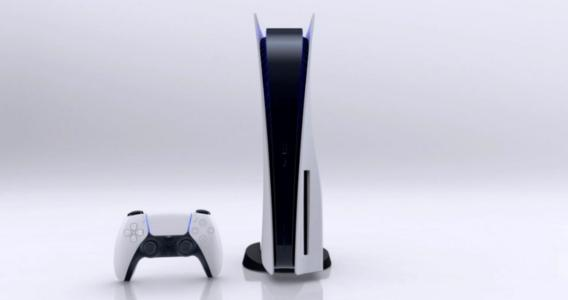

Sony上周四就在北京时间凌晨4点发布了最新一代游戏机Playstation 5 (PS5)，这对玩家们来说是一个大新闻，终于又能玩更高画质更劲爆的新游戏了。
PS5
从公布的配置来看，PS5堪称目前“地表最强”（Xbox还未发布）。PS5拥有近乎即时的加载时间，支持8K视频，光线追踪和基于Ryzen的CPU。
虽然性能好评，但PS5造型却被网友们狠狠调侃了一番。PS5因为其配置强悍，发热量巨大。尽管AMD 7纳米能效很高，但在玩4K游戏时处理器、显卡、固态硬盘火力全开的情况下，主板还是会变成铁板烧。因此这个造型是“索尼付出巨大努力”让PS5拥有强大散热能力的结果。
值得一提的是，为了让游戏加载速度更快，PS5内置定制的825GB高速固态硬盘，尽管容量不算小，但是真要装起游戏来，也就4-6个经典大作。
要想装10几个游戏，外置移动固态硬盘必不可少。要扩容推荐1TB容量的SSK飚王移动固态硬盘SD200，读写速度1GB/s，加载游戏也很快，性价比很高。

