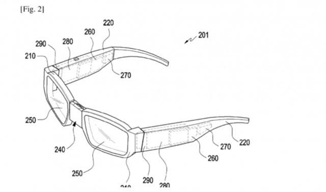

近日据悉，三星公司已经提交了一项新的专利，详细说明AR眼镜如何工作，根据2020年6月4日公布的专利，三星正在研究AR眼镜，该眼镜将连接到另一个设备以投射虚拟显示。

三星VR眼镜新专利 可连接设备投射虚拟显示

三星在该专利当中描述了一种电子设备，该电子设备包括触摸屏、通信模块以及至少一个处理器，将触摸屏和通信模块操作连接，该设备使用通信模块向AR设备传输用于显示第一内容的数据。

在触摸屏上显示用于控制第一内容的第一用户界面，将与第一内容不同的第二内容数据传送给使用通信模块的AR设备，在触摸屏上显示用于控制第二内容的第二用户界面。

AR眼镜在未来可能会有大量的使用案例，包括智能手机的第二块屏幕，以及不用拿起智能手机就能消费的内容等等。【7459789】
