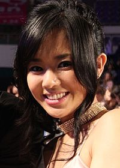

# 苍井空（日语：蒼井 そら，1983年11月11日－）日本前AV女优及AV界代表性人物，现为电视演员。曾为日本女子团体惠比寿麝香葡萄初代成员。2017年1月18日个人推特上，清楚表明“不再具有AV女优的身份了”，“正式”引退

## 经历
2002年，苍井空透过试镜成为了写真女星，同年7月以“苍井空”的艺名为AV《Happy Go Lucky!》试镜，进入Alice Japan公司开始其AV生涯。事实上，苍井空小时候的志愿是成为褓姆（保育士），因此在高中毕业后，入读短期大学修读褓姆课程，取得资格[3]。然而，由于成为AV女郎，使她无缘在褓姆的职业上发展[3]。

因为其萝莉面貌及90厘米的胸围而赢得“童颜巨乳”的外号，获得极大的回响与超高人气，并连续在2003年及2004年蝉连日本《VideoBoy》杂志年度AV女优第一名，在东亚甚至欧美都有知名度。因为其可跟一般明星媲美的知名度，她从2003年起开始参加一般电视戏剧及综艺节目中演出，2004年11月移籍到S1，之后，一直都成为S1的人气女优。2005年末在MOODYZ年末大感谢祭开拍时，更赢得了S1的“最优秀女优赏”[4]。

挟夹着其在AV界的高人气，苍井空转而往电视及电台发展。2003年首次在电视剧《特命系长・只野仁》客串演出。2005年10月，在电视剧《娘王》更担当主要角色之一。之后主要都在综合节目内亮相。由于苍井空的男影迷不断增加，她在2005年成为了当年日本互联网搜寻排名的女性搜寻对象的第2名。2007年11月，苍井空再度出演电视剧，在《神探伽利略》客串演出。直到2009年，苍井空依然除了以艺人及演员的身份亮相外，仍然保留其在AV的活动，不过外间一直都有她要退出AV界的传言。

2010年4月11日，她和红音萤等AV女优在微博和Twitter的帐号被中国网民发现，随后被《东莞时报》报道并被其他媒体广泛转载，大批网民突破中国大陆官方的防火长城的封锁，登录Twitter追随她的帐号。[5][6]由于苍井空在Twitter上号召日本民众为中国青海玉树地震捐款，并在自己的博客发起募捐活动，通过卖自己的写真电脑壁纸来筹善款。[7]而被中国网友盛赞“德艺双馨”。[8] 2010年6月17日，苍井空抵达上海并出席久游勇士发布会，[9][10]与中国网路红人凤姐一同为线上游戏站台。[11]

2010年11月11日苍井空选择在自己生日当天开设新浪微博，在短短50分钟内引发3万博友围观，开博6小时影迷数量轻松超过她Twitter几个月来的影迷人数总和共12.9万，在几天之内影迷数量立即飙升超过40万。至2019年已超过1900万。[12]2011年，杨澜的丈夫、阳光红岩投资集团创始人吴征代表旗下的七星环球娱乐集团在北京与K-1搏击联盟品牌建立合营公司，邀请到苍井空作为嘉宾出席，同时出席的还有刘嘉玲、黄奕以及宋祖英。在最后合影的一张照片中，杨澜、宋祖英、苍井空三人并排站立，在网络上引发大量议论与争议。[13][14][15][16]苍井空在中国大陆的受欢迎，还使得中国电影电视监管部门在2012年4月公布有关“低俗”内容的新限制措施时特别指出，禁止苍井空上内地电视节目。[17]2012年，在因钓鱼台争端而引发的中国反日示威活动期间，苍井空在微博上呼吁“中日人民友好”引发热议。[18]

2012年3月28日，苍井空在北京参加由自己担任主角的微电影《第二梦》新闻发布会。饰演旧上海名媛，并献唱同名主题曲。[19]

2017年1月18日，在个人推特上回复网友提问，正式表态自己不是AV女优，也不会再拍摄作品。而实际上苍井空自2011年7月后，已没有新作品推出，5年来实质上已经引退。[20]

2018年1月1日，苍井空宣布结婚，配偶为在东京担任DJ的NON[21]。她在同年12月宣布自己已经怀孕，并表示自己结婚一年多来，生活没有太大变化。她也表露出对孩子的担忧，她表示孩子未来可能会因为母亲身为AV女优而遭受霸凌，但自己仍然会希望有孩子，因为自己有着与他人相同的梦想。[22]2019年5月1日，她剖腹诞下两名儿子。

